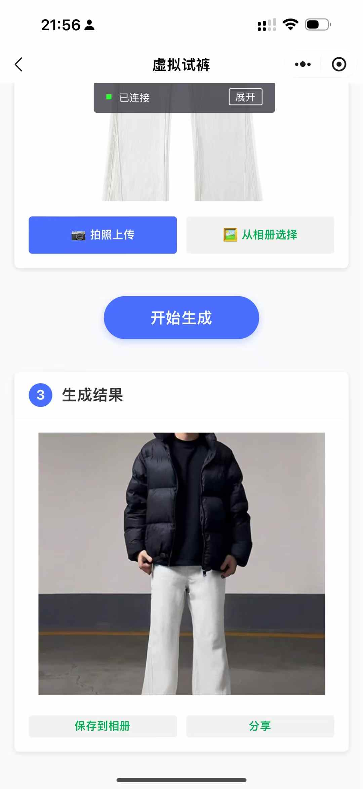

# AI-Virtual-Wardrobe

AI虚拟衣柜是一款微信小程序，通过AI技术为用户提供虚拟试衣体验。用户可以上传自己的照片和喜欢的服装图片，系统将自动生成穿搭效果，让您在购买前就能看到服装的穿着效果。

## 功能介绍
### 虚拟试衣（上装）
用户可以上传自己的照片和喜欢的上衣图片，系统会自动将上衣穿在用户身上，生成虚拟试衣效果。

### 虚拟试裤（下装）
用户可以上传自己的照片和喜欢的裤装图片，系统会自动将裤子穿在用户身上，生成虚拟试裤效果。

### 虚拟试裙（连衣裙）
用户可以上传自己的照片和喜欢的连衣裙图片，系统会自动将连衣裙穿在用户身上，生成虚拟试裙效果。

## 如何运行 (How to Run)
### 前端

1.  安装微信开发者工具。
2.  导入 `frontend` 目录作为小程序项目。
3.  配置后端API地址。

### 后端

1.  确保已安装Python环境。
2.  进入 `backend` 目录。
    ```bash
    cd backend
    ```
3.  安装依赖:
    ```bash
    pip install -r requirements.txt
    ```
4.  运行API服务:
    ```bash
    python Api.py
    ```

## 效果展示





